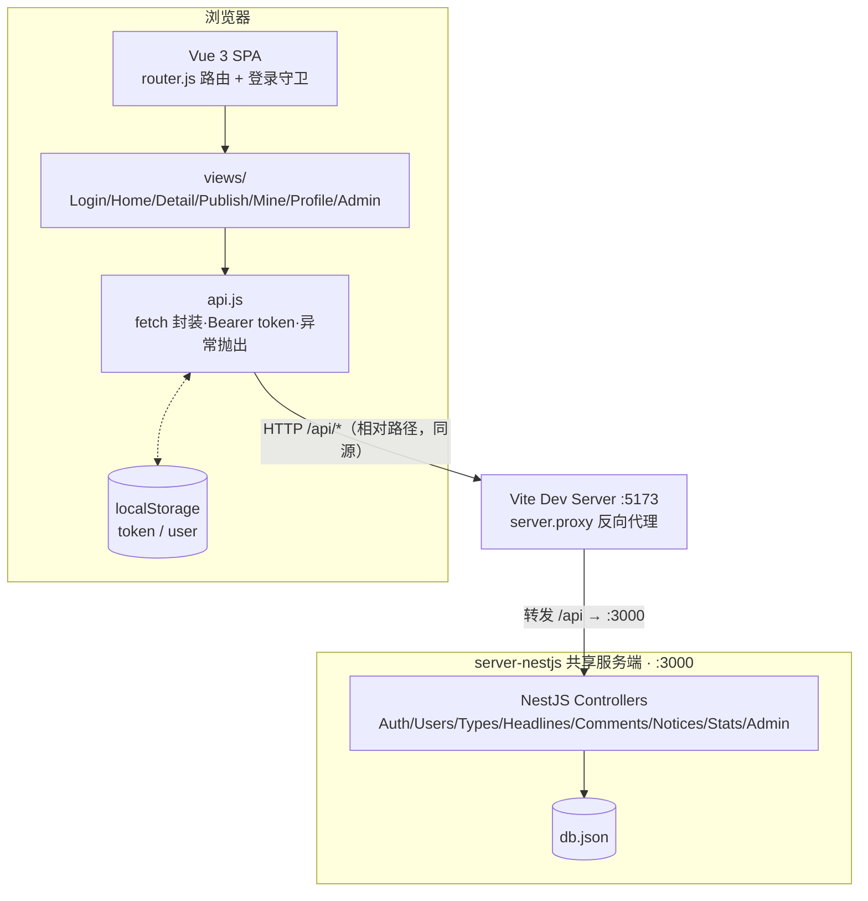

# 微头条 · 网页 B/S 版 — 架构总览

## 1. 项目定位

本项目是「微头条」系统的第 4 版：**B/S（Browser/Server）网页版**。用户无需安装客户端，用浏览器访问 Vite 开发服务器（或构建产物）即可使用；前端页面跑在浏览器中，所有业务数据通过 HTTP 请求发送给共享的 NestJS 服务端（`../server-nestjs`，端口 3000）。

## 2. 技术栈

| 层次 | 技术 | 说明 |
|---|---|---|
| 前端框架 | Vue 3.5（Composition API，`<script setup>`） | `web/src/views/*.vue` 页面组件 |
| 路由 | vue-router 4（`web/src/router.js`） | `createWebHistory` 模式 + 全局前置守卫（登录拦截） |
| 构建工具 | Vite 5 + @vitejs/plugin-vue | dev 端口 5173，`/api` 代理到 `http://localhost:3000` |
| 通信方式 | 原生 `fetch`（`web/src/api.js`） | HTTP + JSON，`Bearer token` 鉴权，`code !== 0` 抛异常 |
| 服务端 | 共享 NestJS（`../server-nestjs`，:3000） | 提供 `/api/*` REST 接口，数据落 `db.json` |
| 样式 | 手写 CSS（`web/src/style.css`） | 无 UI 框架 |

依赖极简：运行时仅 `vue`、`vue-router`。

## 3. B/S 结构

- **Browser（浏览器）**：加载 SPA。路由与登录态均由前端掌控：token 与 user 存 `localStorage`，`router.beforeEach` 拦截未登录访问并跳转 `/login?redirect=...`。
- **Server（服务器）**：
  - 开发期：Vite dev server（5173）作为静态资源服务器，并充当 **反向代理**——`vite.config.js` 中把 `/api` 转发到 `http://localhost:3000`，因此前端代码里只需写相对路径 `/api/...`，不存在跨域问题。
  - 业务服务端：共享 NestJS，负责鉴权、业务校验与数据持久化。

### 与服务器交互方式

`api.js` 封装 `request(path, {method, body})`：拼 `/api` 前缀、自动附带 `Authorization: Bearer <token>`、body 序列化为 JSON；解析响应后若 `code !== 0` 直接 `throw new Error(msg)`，由各页面 `try/catch` 展示错误。这与 C/S 版「返回错误对象」不同，是异常驱动的错误处理。

关键代码（`web/src/api.js:2-22`）：

```js
export async function request(path, { method = 'GET', body } = {}) {
  const token = localStorage.getItem('token') || '';
  const res = await fetch('/api' + path, {
    method,
    headers: {
      'Content-Type': 'application/json',
      ...(token ? { Authorization: 'Bearer ' + token } : {}),
    },
    body: body !== undefined ? JSON.stringify(body) : undefined,
  });
  let json;
  try { json = await res.json(); } catch { throw new Error('服务器响应异常'); }
  if (json.code !== 0) throw new Error(json.msg || '请求失败');
  return json.data;
}
```

路由守卫（`web/src/router.js:19-25`）：

```js
router.beforeEach((to) => {
  const token = localStorage.getItem('token');
  if (!to.meta.public && !token) return { name: 'login', query: { redirect: to.fullPath } };
  if (to.name === 'login' && token) return { name: 'home' };
});
```

## 4. 架构图



> 生产部署时可用 `vite build` 产出静态文件，由 Nginx 等承担同样的「静态托管 + /api 反代」角色，浏览器直连服务器域名，仍为标准 B/S 三层结构。

## 5. 目录结构

```
web/
├── src/
│   ├── main.js          # createApp 挂载入口
│   ├── App.vue          # 导航栏 + <router-view> 布局（搜索/退出）
│   ├── router.js        # 7 条路由 + 登录/权限守卫
│   ├── api.js           # request/api.get/post/put/del 封装
│   ├── style.css        # 全局样式
│   └── views/
│       ├── Login.vue    # 登录/注册
│       ├── Home.vue     # 首页信息流 + 热榜 + 公告
│       ├── Detail.vue   # 详情 + 点赞 + 评论/回复
│       ├── Publish.vue  # 发布头条
│       ├── Mine.vue     # 我的头条（行内编辑/删除）
│       ├── Profile.vue  # 个人中心 + 修改密码
│       └── Admin.vue    # 管理后台（6 个 Tab）
├── index.html
└── vite.config.js       # 端口 5173 + /api 代理
```

## 6. 关键设计点

1. **真正的路由**：与 C/S 版的视图状态机不同，B/S 版使用 vue-router，URL 与页面一一对应（`/headlines/:id` 等），支持 redirect 回跳、`<router-view :key="route.fullPath">` 强制刷新。
2. **异常驱动错误处理**：`api.js` 对 `code !== 0` 抛异常，页面统一 `try/catch` 设置 `err.value`。
3. **登录态守卫**：全局 `beforeEach` + 路由 `meta.public / meta.admin` 元信息控制访问。
4. **同源代理**：开发期靠 Vite proxy 解决跨域，前端不感知服务器地址（对比 C/S 版可在登录页配置服务器地址）。
