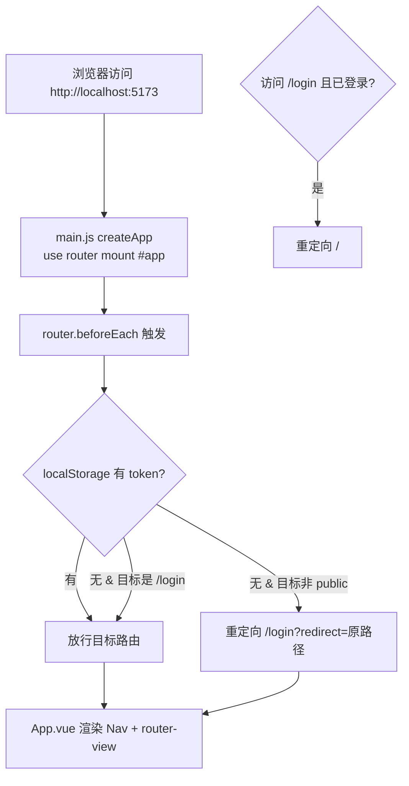
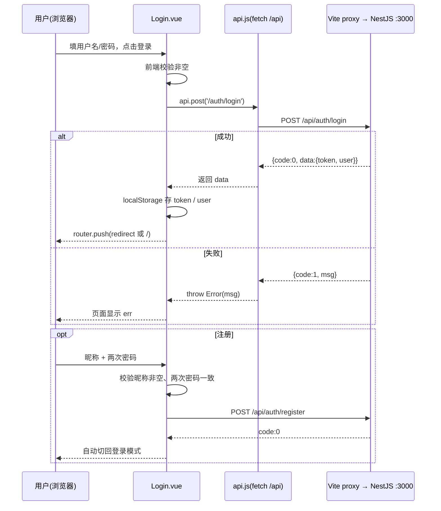
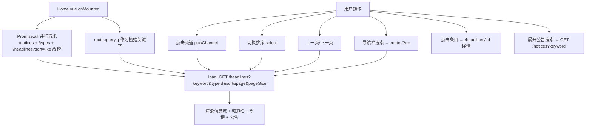
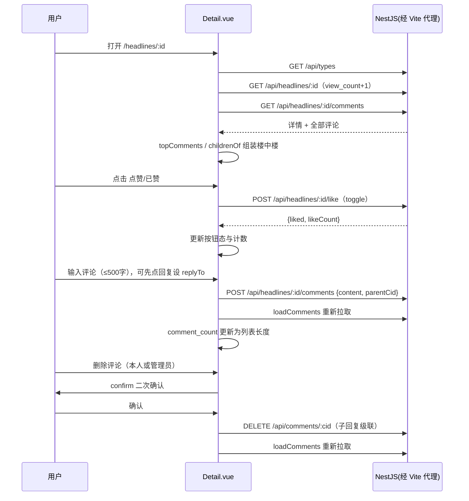
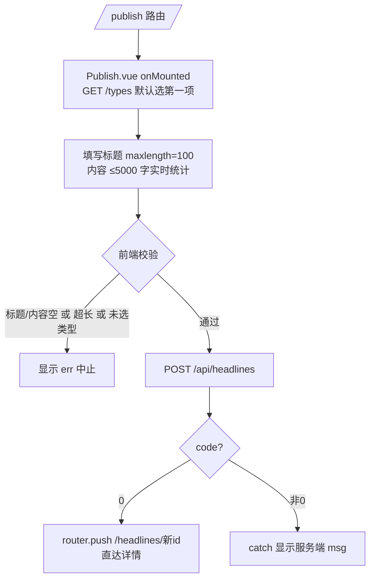
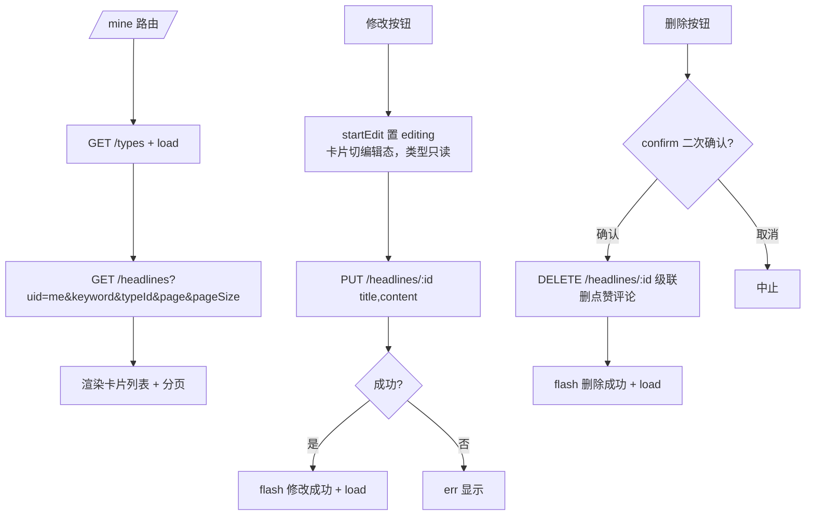
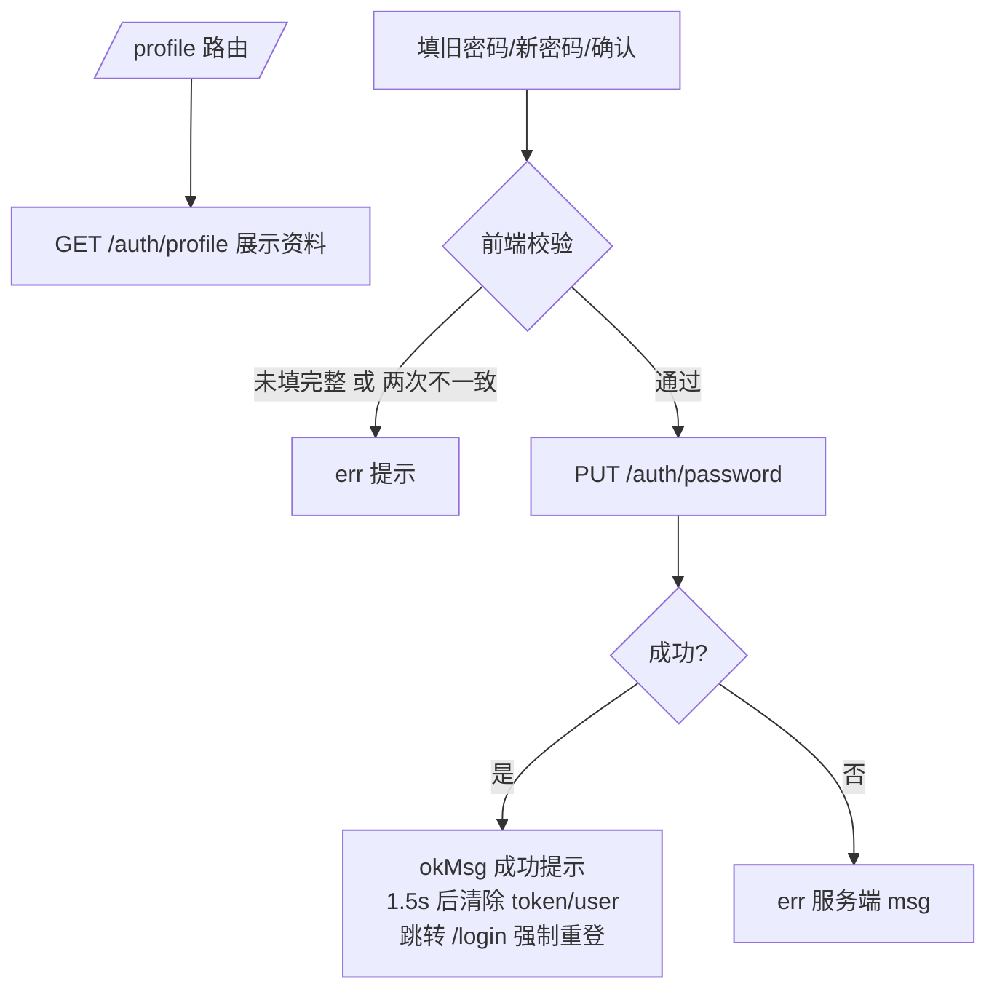
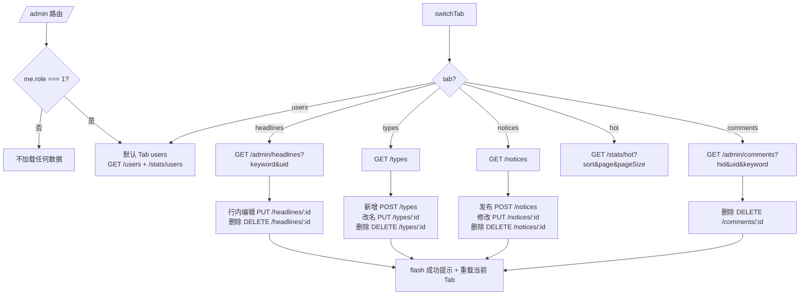
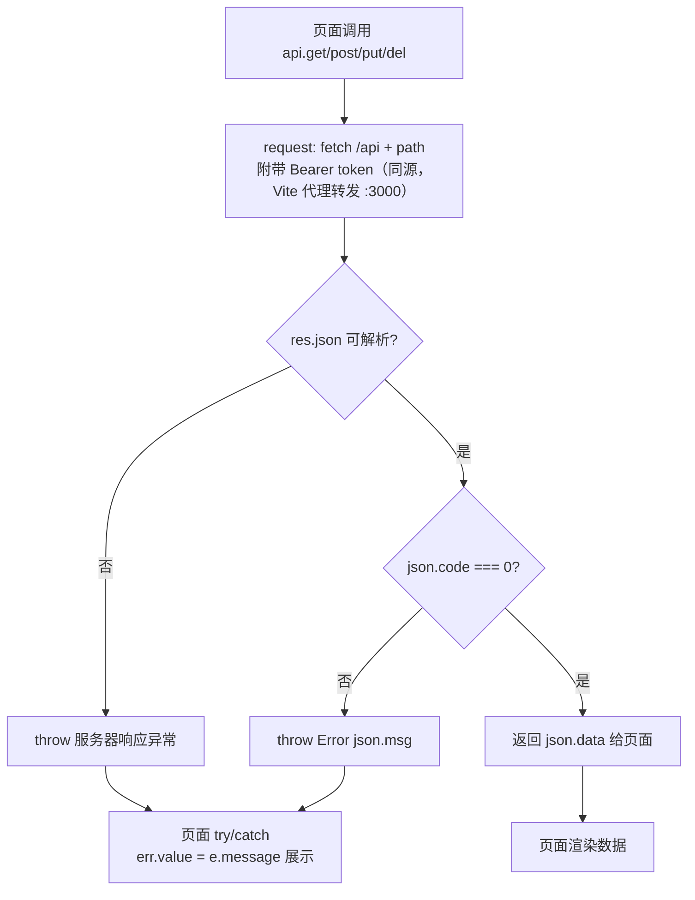

# 微头条 · 网页 B/S 版 — 业务流程图

## 1. 应用启动与路由守卫流程

## 2. 登录 / 注册流程（sequenceDiagram）

## 3. 首页浏览流程

## 4. 详情页：浏览 / 点赞 / 评论 / 回复 / 删除（sequenceDiagram）

## 5. 发布头条流程

## 6. 我的头条管理流程（行内编辑）

## 7. 修改密码流程

## 8. 管理后台流程（role=1）

## 9. 统一请求/响应处理流程（api.js，异常驱动）

