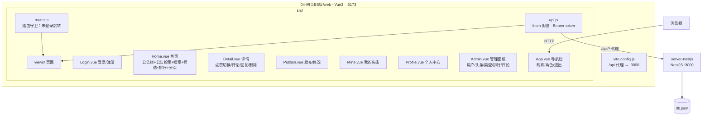
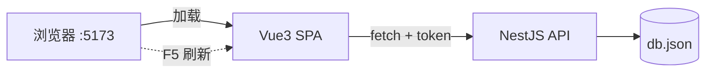

# 微头条网页版（Vue3）

Vue 3（Composition API + `<script setup>`）+ Vite + vue-router 的微头条 BS 版前端，调用共享后端 `server-nestjs`（http://localhost:3000/api）。

## 启动

```bash
# 1. 先启动后端（../server-nestjs）
cd server-nestjs && npm install && npm run dev

# 2. 启动前端
cd 04-网页BS版/web
npm install
npm run dev      # http://localhost:5173 ，/api 已代理到 localhost:3000
```

## 构建

```bash
npm run build    # 产物在 dist/
npm run preview
```

## 测试账号

| 用户名 | 密码 | 角色 |
|--------|----------|------|
| admin | 123456 | 管理员（可见"管理员面板"） |
| tom | 123456 | 普通用户 |
| jerry | 123456 | 普通用户 |

## 功能

- 登录 / 注册（确认密码校验），token 存 localStorage，未登录访问受保护页自动跳转登录
- 头条首页：公告栏、关键字搜索、类型筛选、时间/点赞/评论/浏览排序、分页
- 发布头条（标题 / 内容 ≤5000 字 / 类型下拉）
- 头条详情：点赞/取消点赞（状态回显）、评论列表（时间正序）、回复评论、删除自己的评论
- 我的头条：按关键字/类型查询、修改（类型不可改）、删除（confirm 二次确认）
- 个人中心：查看用户信息、修改密码（旧密码验证 + 两次新密码一致）
- 管理员面板（role==1）：用户列表与活跃排行、头条管理（改/删/按发布者查询）、类型管理（有关联头条禁止删除）、公告管理、热门头条排行（切换排序+分页）、评论管理（筛选+删除）

## 项目构成（mermaid）




